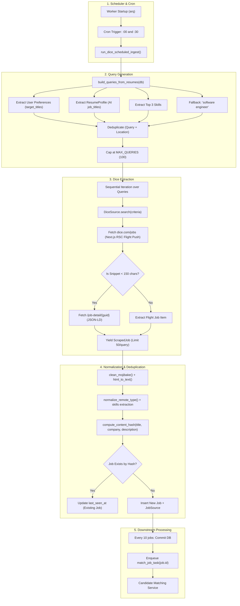
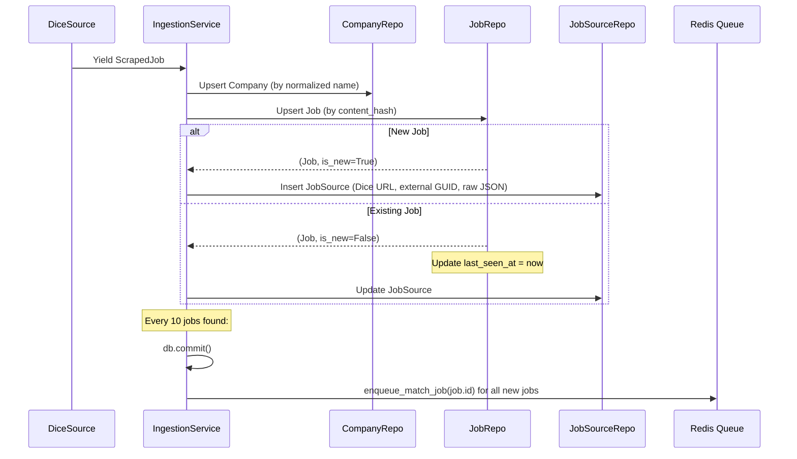

# Dice Job Scraping System Architecture & Operational Guide (H-T-JobBoard-V3)

---

## 1. Executive Summary: What, Why & How

### What is the Dice Scraper?
In the **`H-T-JobBoard-V3`** platform, the Dice Scraper is an automated, scheduled background worker pipeline designed to crawl, ingest, normalize, and deduplicate tech job postings from [dice.com](https://www.dice.com). It transforms raw unstructured and semi-structured job feeds into canonical PostgreSQL records and immediately streams new jobs into candidate-matching workflows.

### Why Does It Exist?
Traditional job scrapers rely on static, hardcoded keywords (e.g., `"software engineer"`) that quickly become stale and fail to surface niche roles desired by active candidates. The V3 Dice scraper solves this by **reversing the ingestion model**:
1. **Dynamic Demand-Driven Ingestion**: Instead of pulling random jobs, it inspects active user resumes and profile preferences to scrape *only* roles tailored to current job seekers.
2. **High-Frequency Tech Sourcing**: Dice is a premier tech-focused job portal. Running frequent sweeps (every 30 minutes) captures newly published roles before competitors.
3. **Automated Candidate Matching**: Every newly ingested job instantly triggers asynchronous matching algorithms against candidate resumes.

### High-Level Architecture Pipeline



---

## 2. Scheduler & Run Cycle Mechanics

### Worker Initialization
The ingestion scheduler runs inside an **ARQ** asynchronous task worker process:
- **Command Entry**: `arq app.workers.worker.WorkerSettings`
- **Configuration Files**:
  - `H-T-JobBoard-V3-main/app/workers/worker.py`
  - `H-T-JobBoard-V3-main/docker/Dockerfile.worker`
  - `H-T-JobBoard-V3-main/deploy/docker-compose.dev.yml`

During `startup(ctx)`:
1. Loads application settings (`app.config.Settings`).
2. Configures structured JSON logging (`structlog`).
3. Instantiates an async SQLAlchemy engine and registers `ctx["session_factory"] = get_session_factory()`.
4. Connects to Redis via `get_redis_settings()`.

### Cron Configuration
In `app/workers/worker.py`:
```python
jobs.append(
    cron(
        run_dice_scheduled_ingest,
        name="run_dice_scheduled_ingest",
        unique=True,
        timeout=1200,  # 20-minute execution safety timeout
        **scheduler_cron_kwargs(settings.ingest_dice_interval_minutes),
    )
)
```

- **Interval**: `settings.ingest_dice_interval_minutes = 30` (default).
- **Execution Windows**: Calculated by `scheduler_cron_kwargs()`:
  $$\text{minute} \in \{0, 30\}$$
  The cron fires exactly at **minute :00** and **minute :30** of every hour.
- **Concurrency Guard**: `unique=True` prevents a new sweep from launching if the previous 30-minute run is still executing.
- **Timeout**: `timeout=1200` (20 minutes). If a scrape encounters heavy delays, it is aborted before the next cycle fires.

---

## 3. Resume-Driven Query Builder (`query_builder.py`)

Rather than scraping arbitrary tech terms, the V3 architecture derives search terms from real users.

### Database Query
In `app/scrapers/query_builder.py`, `build_queries_from_resumes()` queries:
```sql
SELECT resume_profiles.*, user_preferences.*
FROM resume_profiles
JOIN resumes ON resume_profiles.resume_id = resumes.id
JOIN users ON resumes.user_id = users.id
LEFT OUTER JOIN user_preferences ON user_preferences.user_id = users.id
WHERE users.is_active = TRUE
  AND resumes.is_primary = TRUE
  AND resume_profiles.parsed_at IS NOT NULL;
```

### Hierarchy of Search Criteria
For each active profile, `_build_from_profile()` evaluates a 4-tier waterfall:

| Priority | Source | Description / Fallback |
| :--- | :--- | :--- |
| **1. Primary** | `UserPreference.target_titles` | User-defined job titles (up to first 5 titles). |
| **2. Secondary** | `ResumeProfile.job_titles` | AI-extracted job titles parsed from the uploaded resume (up to first 3). |
| **3. Tertiary** | `ResumeProfile.skills` | Top 3 technical skills concatenated (e.g. `"Kubernetes Docker AWS"`). |
| **4. Global Fallback** | Hardcoded Default | `"software engineer"` @ `"United States"` if no profiles or preferences exist. |

### Dual Work-Mode & Location Resolution
Location targeting accommodates both remote and regional preferences:
1. **Remote Openings**: If `UserPreference.is_remote = True` (or default), appends `("United States", ["remote"])`.
2. **Local Openings**: If `UserPreference.target_locations` are specified (e.g., `["Austin, TX", "Seattle, WA"]`), appends `(location, ["onsite", "hybrid"])`.

### Limits & Deduplication
- **Hard Cap**: `MAX_QUERIES = 100`.
- **Deduplication Key**: `_normalize_query(f"{domain}|{location}")`.
  Lowercase, strip punctuation, collapse whitespace. If 15 candidates are seeking `"Backend Engineer"` in `"United States"`, it creates **exactly one query**.

---

## 4. Dice Scraping Mechanics (`dice.py`)

### Target Endpoints
- **Search Endpoint**: `https://www.dice.com/jobs`
- **Detail Endpoint**: `https://www.dice.com/job-detail/{guid}`

### Protocol: Next.js React Server Component (RSC) Flight Parsing
Modern Dice does not render simple HTML markup for listings. It is a Next.js App Router application utilizing React Server Components (RSC).
1. **Streaming Chunks**: Data is embedded in `<script>` tags as flight pushes:
   ```javascript
   self.__next_f.push([1, "...{\"jobList\":{\"data\":[{\"guid\":\"...\"}]}}..."])
   ```
2. **Regex & Raw JSON Extraction**:
   - `_iter_flight_chunks()` finds matching push scripts.
   - `parse_flight_joblist()` scans for `"jobList":` and uses Python's `json.JSONDecoder().raw_decode` to parse the JSON array directly from the flight stream.
3. **Fallback GUID Extractor**: If flight chunk structures change, `extract_guids_fallback()` runs regex `_GUID_RE = /job-detail/([0-9a-f]{8}-[0-9a-f]{4}-...)` across the raw HTML.

### Detail Enrichment via Schema.org JSON-LD
- Brief search snippets often truncate the job description.
- If snippet length $< 150$ characters, `DiceSource._fetch_detail(guid)` fetches the dedicated job detail page.
- Parses `<script type="application/ld+json">` with `@type: "JobPosting"` to capture:
  - Full unabridged job description HTML
  - Canonical job title
  - `hiringOrganization.name`
  - Canonical employment and workplace types

### Search Query Parameters Built by `_build_search_params`
```python
params = {
    "q": criteria.domain,
    "page": str(page),
    "pageSize": "20",
}
```
- **Recency Filtering**:
  - `posted_within_days <= 1` $\rightarrow$ `filters.postedDate = "ONE"`
  - `posted_within_days <= 3` $\rightarrow$ `filters.postedDate = "THREE"`
  - `posted_within_days <= 7` $\rightarrow$ `filters.postedDate = "SEVEN"`
- **Workplace Filtering**:
  - `"remote"` $\rightarrow$ `filters.workplaceTypes = "Remote"`
  - `"hybrid"` $\rightarrow$ `filters.workplaceTypes = "Hybrid"`
  - `"onsite"` $\rightarrow$ `filters.workplaceTypes = "On-Site"`

### Limits Per Query
- `per_query_limit = 50` (enforced in `run_dice_scheduled_ingest`).
- `settings.dice_max_results = 100`.
- Pagination pulls up to 3 pages ($3 \times 20 = 60$, terminating upon yielding 50 items).

---

## 5. Ingestion, Normalization & Deduplication

### Data Cleaning (`normalizer.py`)
1. **Mojibake Cleaning**: Resolves character corruption (e.g., `’` $\rightarrow$ `'`, `–` $\rightarrow$ `–`).
2. **HTML to Text**: Strips HTML tags, unescapes entities, and collapses excessive whitespace.
3. **Workplace Normalization**: Maps values into `"remote"`, `"hybrid"`, `"onsite"`, or `"unknown"`.
4. **Skill Extraction**: Matches raw text against over 100+ compiled regex patterns (Cloud, Languages, Databases, DevOps, Cybersecurity, Data/AI).
5. **Role-Derived Skill Guarantees**: Injects required foundational tags (e.g., `"data engineer"` automatically guarantees `"Data Engineering"` and `"SQL"`).

### Deterministic Content Hashing
To prevent identical jobs from being re-inserted under different URLs, `compute_content_hash()` creates a deterministic SHA-256 fingerprint:
```python
payload = f"{norm_title}|{norm_company}|{clean_desc}"
return hashlib.sha256(payload.encode("utf-8")).hexdigest()
```

### PostgreSQL Persistence (`ingestion_service.py`)


- **Stale Listing Inactivation**: At the end of each run, jobs from `"dice"` whose `last_seen_at` is older than 72 hours are automatically flipped to `is_active = FALSE`.

---

## 6. Downstream Trigger: Candidate Matching

Whenever a **genuinely new job** (`is_new=True`) is committed to the database:
1. `enqueue_match_job(job.id)` pushes an ARQ job with task name `match_job_task`.
2. A worker picks up `match_job_task(ctx, job_id_str)`:
   - Calls `matching_service.match_job_for_all_users(db, job_id)`.
   - Computes weighted score across Skills (50%), Title/Domain (30%), Experience Level (10%), and Workplace Preference (10%).
   - Persists high-scoring matches to the `job_matches` table.
   - Enqueues user notifications (`notify_matches_task`).

---

## 7. Operational Numbers & Capacity

| Metric | Minimum (Fallback) | Configured Ceiling / Upper Limit | Typical Production Run |
| :--- | :--- | :--- | :--- |
| **Cron Frequency** | Every 30 minutes | Every 30 minutes | Every 30 minutes (48 runs/day) |
| **Active Search Queries** | 1 (`"software engineer"`) | 100 queries (`MAX_QUERIES`) | 15 – 45 unique queries |
| **Results Per Query** | Up to 50 jobs | Up to 50 jobs | 20 – 50 jobs |
| **Scraped Jobs Per 30 Min** | **50 jobs** | **5,000 jobs** ($100 \times 50$) | **300 – 1,500 raw items** |
| **New Unique Jobs Ingested** | ~10 – 30 jobs | Up to 5,000 jobs | **75 – 400 new jobs/run** |
| **Batching Mechanism** | None (runs all active) | None (runs all active) | Unlike LinkedIn (batch=6), Dice runs all |
| **Stale Eviction Window** | 72 hours | 72 hours | Inactivates unrefreshed postings |

---

## 8. Summary Comparison: V3 Architecture vs Current `backend-ht`

| Dimension | `H-T-JobBoard-V3` | Current `backend-ht` |
| :--- | :--- | :--- |
| **Task Queue** | ARQ (Redis-backed, `WorkerSettings`) | Background Tasks / ARQ Worker |
| **Scheduling** | Centralized in `app/workers/scheduler_task.py` | Centralized in `app/queue/scheduler.py` |
| **Query Strategy** | Dynamic resume + preference extraction (100 cap) | Ported dynamic candidate profile extraction |
| **Dice Parsing** | Next.js RSC Flight streaming + JSON-LD details | Direct endpoint scraping / API simulation |
| **Deduplication** | SHA-256 on `title\|company\|description` | SHA-256 content hashing + external ID tracking |
| **Matching Trigger** | Immediate enqueue per 10 new jobs | Direct trigger / lightweight match scoring |

---
*Document prepared for Hire & Tech Engineering Architecture Reference.*
