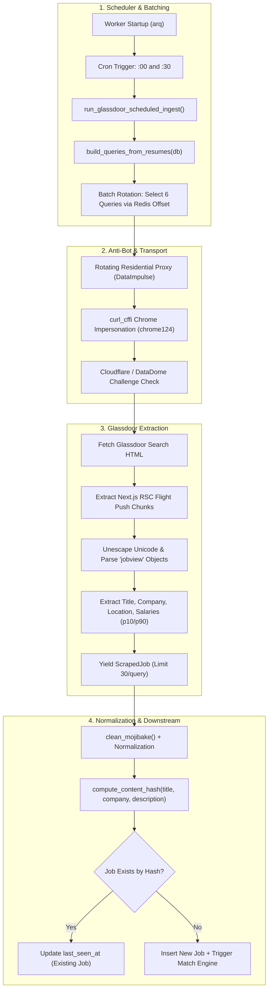

# Glassdoor Job Scraping System Architecture & Operational Guide (H-T-JobBoard-V3)

---

## 1. Executive Summary: What, Why & How

### What is the Glassdoor Scraper?
In the **`H-T-JobBoard-V3`** platform, the Glassdoor Scraper is a specialized background crawler designed to extract tech job postings, company ratings, and salary estimates from [glassdoor.com](https://www.glassdoor.com). It normalizes raw job listings and streams them into the canonical PostgreSQL database and candidate matching pipeline.

### Why Does It Exist?
1. **Salary Transparency & Insights**: Glassdoor is the primary source for crowd-sourced employer ratings and estimated salary bands (10th to 90th percentile ranges), which improves candidate job match quality.
2. **Enterprise & Non-Tech Sector Tech Jobs**: Unlike Dice (which skews heavily toward contract and pure IT agencies), Glassdoor captures in-house corporate engineering roles across finance, healthcare, and retail.
3. **Dynamic Targeting**: Like Dice, it reads active candidate resumes rather than static search terms.

### The Big Difference: Glassdoor's Anti-Bot Challenge
Glassdoor enforces the most aggressive anti-scraping defenses of any major job board:
- **Cloudflare Turnstile & Challenge Pages**
- **DataDome Bot Detection**
- **PerimeterX & Captcha Verification**
- **TLS Fingerprinting (JA3/JA4)**

Because standard HTTP libraries (`requests`, plain `httpx`) get blocked immediately with HTTP `403 Forbidden`, the V3 architecture employs **browser TLS impersonation (`curl_cffi`)** and **rotating residential proxy infrastructure**.

### High-Level Architecture Pipeline



---

## 2. Scheduler, Cadence & The 6-Query Batch Rotation

### Worker Cron Configuration
In `app/workers/worker.py`:
```python
jobs.append(
    cron(
        run_glassdoor_scheduled_ingest,
        name="run_glassdoor_scheduled_ingest",
        unique=True,
        timeout=1800,  # 30-minute safety timeout
        **scheduler_cron_kwargs(settings.ingest_glassdoor_interval_minutes),
    )
)
```

- **Execution Cadence**: Every 30 minutes (`settings.ingest_glassdoor_interval_minutes = 30`).
- **Cron Set**: $\text{minute} \in \{0, 30\}$.

### The Critical 6-Query Batching Mechanism (`batch_size=6`)
Unlike Dice (which runs all active queries at once), Glassdoor uses **controlled batching**:
```python
async def run_glassdoor_scheduled_ingest(ctx: dict[str, Any]) -> dict[str, Any]:
    """Cron task: sweep Glassdoor jobs using resume-driven queries (batched to 6 queries)."""
    return await _run_smart_ingest(
        ctx, source_name="glassdoor", per_query_limit=30, batch_size=6
    )
```

#### Why Batch to 6 Queries?
1. **Anti-Ban Protection**: Running 50–100 aggressive searches on Glassdoor in 10 minutes will quickly burn your residential proxy quota and trigger IP subnet bans.
2. **Sliding Offset Rotation**:
   The helper `_rotate_queries()` uses a persistent Redis cursor (`scraper:query_offset:glassdoor`):
   - **Run 1 (:00)**: Scrapes Queries 1 – 6
   - **Run 2 (:30)**: Scrapes Queries 7 – 12
   - **Run 3 (:00)**: Scrapes Queries 13 – 18 (and wraps around)
   This guarantees that all candidate searches are serviced fairly over the course of the day without overwhelming Glassdoor.

---

## 3. Anti-Bot Defense & Transport Layer

### Chrome TLS Impersonation (`curl_cffi`)
Glassdoor validates HTTP client TLS fingerprints. Standard Python clients negotiate TLS ciphers in a recognizable order that Cloudflare flags.
In `app/scrapers/sources/glassdoor.py`:
```python
def _make_default_session_factory(impersonate: str):
    def make(proxy_url: str | None):
        from curl_cffi.requests import AsyncSession
        return AsyncSession(
            impersonate="chrome124",  # Mimics exact Chrome 124 TLS ClientHello & headers
            proxies={"http": proxy_url, "https": proxy_url} if proxy_url else None,
            timeout=35,
        )
    return make
```

### Rotating Residential Proxy Integration
Configured with residential proxy networks (e.g. DataImpulse):
* `DATAIMPULSE_HOST = "gw.dataimpulse.com"`
* `DATAIMPULSE_ROTATING_PORT = 823`
* Formats authenticated credentials: `http://{username}__cr.us:{password}@{host}:{port}`

### Automated Challenge Detection (`is_challenge_page`)
Before parsing, every response is scanned for anti-bot challenge signatures:
```python
CF_CHALLENGE_MARKERS = (
    "cf-browser-verification", "cf_chl_", "cf-chl-", "challenge-platform",
    "challenges.cloudflare.com", "cf-turnstile", "just a moment...",
    "attention required! | cloudflare", "datadome", "geo.captcha-delivery.com"
)
```
If a challenge is detected:
1. It records a block with the circuit breaker (`breaker.record_block("glassdoor")`).
2. Retries up to 5 times on a fresh residential IP before failing gracefully.

---

## 4. Extraction Protocol: Next.js RSC Flight Push Parsing

### Target Endpoint
```text
https://www.glassdoor.com/Job/jobs.htm?sc.keyword={query}&locT=C&locId=0&locKeyword={location}
```

### Parsing React Server Component (RSC) Streams
Glassdoor embeds search results inside Next.js streaming flight push scripts:
```html
<script>self.__next_f.push([1, "...{\"jobview\":{\"header\":{\"jobTitleText\":\"DevOps Engineer\"...}}..."])</script>
```

#### The Extraction Steps:
1. **Extract Chunks**: Regex captures all push payloads:
   ```python
   chunks = re.findall(r"self\.__next_f\.push\(\[1,\s*\"(.*?)\"\]\)", resp.text)
   ```
2. **Unescape Stream Text**: Unescapes Unicode (`\u0026` $\rightarrow$ `&`) and escaped characters (`\"` $\rightarrow$ `"`, `\\` $\rightarrow$ `\`).
3. **Split by `"jobview":`**: Splits the unified text stream into individual job objects.
4. **Regex Extraction**:
   - `jobTitleText`: Job title
   - `employerNameFromSearch`: Company name
   - `seoJobLink`: Canonical job URL
   - `locationName`: Job location
   - `p10` & `p90`: 10th and 90th percentile salary values
   - `listingId` / `jobId`: External unique identifier

---

## 5. Ingestion, Salary Normalization & Deduplication

### Salary Percentile Extraction
Glassdoor search cards include estimated salary distributions:
- `p10`: Estimated minimum base salary (e.g. `110000`)
- `p90`: Estimated maximum base salary (e.g. `145000`)
- Converted into clean currency fields:
  ```python
  salary_min = float(salary_min_m.group(1))
  salary_max = float(salary_max_m.group(1))
  salary_currency = "USD"
  ```

### Content Hashing & Persistence
Each job is normalized and fingerprinted:
$$\text{SHA-256}(\text{normalized\_title} \mid \text{normalized\_company} \mid \text{clean\_description})$$
- Upserts the company name into `companies`.
- Keyed by `content_hash` into `jobs`.
- If already seen, updates `last_seen_at` without duplication.

---

## 6. Operational Numbers & Capacity

| Metric | Minimum (Fallback) | Configured Ceiling / Upper Limit | Typical Production Run |
| :--- | :--- | :--- | :--- |
| **Cron Frequency** | Every 30 minutes | Every 30 minutes | Every 30 minutes (48 runs/day) |
| **Batch Size per Run** | 1 query | **6 queries** (`batch_size=6`) | 6 queries per cycle |
| **Results Per Query** | Up to 30 jobs | Up to 30 jobs (`per_query_limit=30`) | 15 – 30 jobs |
| **Raw Jobs Scraped Per 30 Min** | **30 jobs** | **180 jobs** ($6 \times 30$) | **90 – 160 raw items** |
| **Daily Glassdoor Sourcing Yield** | ~1,400 jobs/day | **8,640 jobs/day** ($180 \times 48$) | **2,500 – 4,500 jobs/day** |
| **Transport Defense** | None | Residential Proxies + Chrome124 TLS | Rotating IP pool |
| **Stale Invalidation** | 72 hours | 72 hours | Inactivates unrefreshed postings |

---

## 7. Comparison Matrix: V3 vs `backend-ht`

| Dimension | `H-T-JobBoard-V3` | Current `backend-ht` |
| :--- | :--- | :--- |
| **Transport Client** | `curl_cffi` (Chrome 124 TLS impersonation) | `httpx` with `build_collection_client` |
| **Proxy Integration** | DataImpulse residential proxy wrapper | Configurable proxy client |
| **Scheduling Strategy** | 6-query sliding batch rotation via Redis offset | Dynamic resume query builder |
| **Search Parsing** | Next.js RSC Flight push chunk regex | Next.js RSC Flight push chunk regex |
| **Deduplication** | Content hash + external ID tracking | Source ID tracking + canonical hash |
| **Anti-Bot Check** | Challenge page inspector + circuit breaker | `CHALLENGE_MARKERS` + retry backoff |

---
*Document prepared for Hire & Tech Engineering Architecture Reference.*
