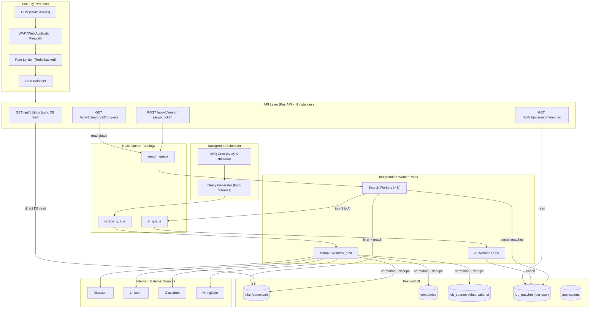
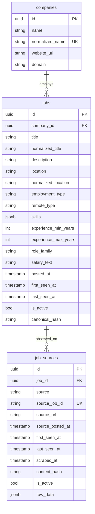
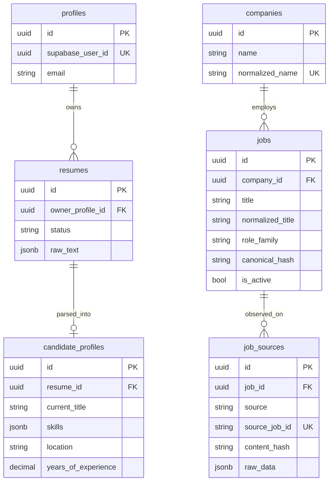
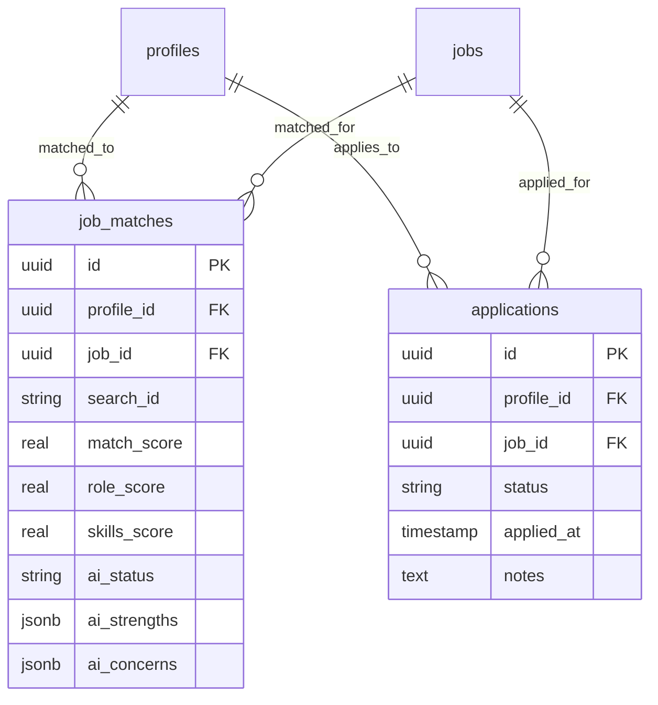
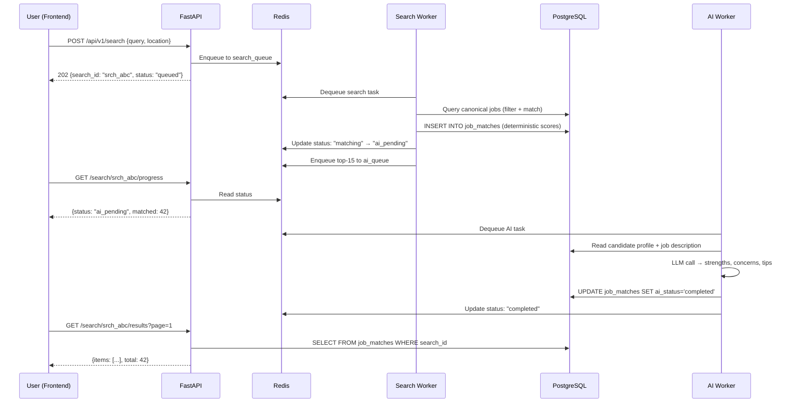
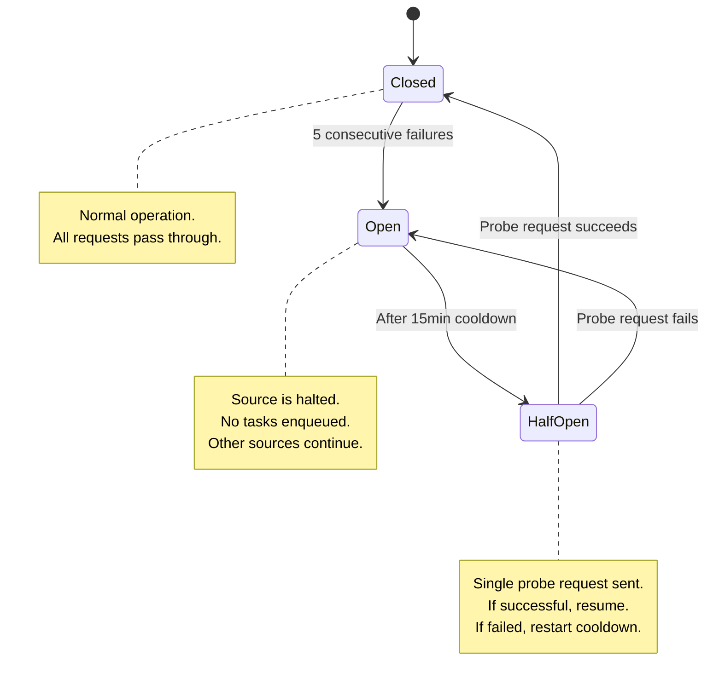
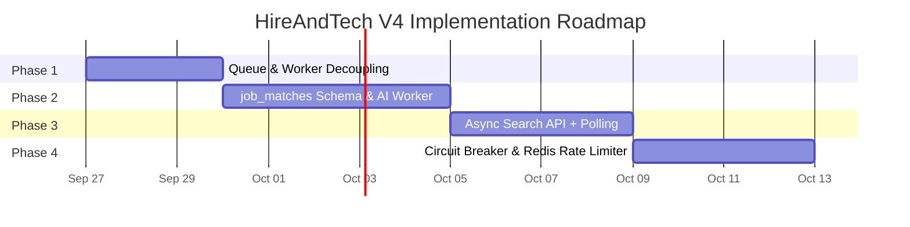

# HireAndTech Platform Architecture V4 — Scalable Job Intelligence System

> **Document version**: 4.0  
> **Last verified against codebase**: 2026-09-26  
> **Repository**: `backend-ht` (`origin/main` @ `285ce61`)

---

## Table of Contents

1. [Executive Summary](#1-executive-summary)
2. [The Problem — Why the Old Architecture Breaks at Scale](#2-the-problem--why-the-old-architecture-breaks-at-scale)
3. [The Solution — Platform-Driven Architecture](#3-the-solution--platform-driven-architecture)
4. [System Architecture Overview](#4-system-architecture-overview)
5. [Current Implementation Audit — What is Already Built](#5-current-implementation-audit--what-is-already-built)
6. [Gap Analysis — What is Remaining](#6-gap-analysis--what-is-remaining)
7. [Data Model](#7-data-model)
8. [Queue & Worker Topology](#8-queue--worker-topology)
9. [API Contract Design](#9-api-contract-design)
10. [Resilience & Security Layer](#10-resilience--security-layer)
11. [Phased Implementation Roadmap](#11-phased-implementation-roadmap)
12. [Scaling Strategy](#12-scaling-strategy)
13. [Appendix — File Reference Map](#13-appendix--file-reference-map)

---

## 1. Executive Summary

HireAndTech is a **job intelligence platform** that continuously discovers, normalizes, deduplicates, and stores tech job listings from multiple public sources (Dice, LinkedIn, Glassdoor, HiringCafe). Users never trigger live web scraping — they search a pre-built, always-fresh global job database.

**Core principle**: The platform collects jobs in the background; users read from the database.

```
Platform Side (always running)     │     User Side (on-demand)
                                   │
Sources → Scheduler → Workers      │     User → API → Database → Filter
       → Scrape → Normalize        │          → Match → Rank → Results
       → Deduplicate → Store       │
```

---

## 2. The Problem — Why the Old Architecture Breaks at Scale

### 2.1 The Old Flow

In the original architecture, every user search triggered the entire pipeline:

```
User clicks "Search"
     ↓
FastAPI receives request
     ↓
Scrapers hit Dice / LinkedIn / Glassdoor
     ↓
Raw jobs collected
     ↓
AI processes and enriches jobs
     ↓
Jobs saved to database
     ↓
Results returned to user
```

### 2.2 The Scaling Problem — Illustrated

Imagine only **one job** exists in the market: *"Senior Python Developer at ABC Corp"*.

```
User A searches → Scrape → AI → Save    (same job)
User B searches → Scrape → AI → Save    (same job again)
User C searches → Scrape → AI → Save    (same job again)
```

With **100 users**, this means:

| Problem | Impact |
|:---|:---|
| **100× redundant scraping** | Same job scraped 100 times from the same source |
| **100× AI processing cost** | LLM/AI called 100 times on identical data |
| **External rate limiting** | Dice/LinkedIn/Glassdoor block the IP after repeated hits |
| **Worker overload** | Single worker pool processes everything serially |
| **Response latency** | Users wait 5–30 seconds while scraping + AI completes |
| **Server crash risk** | Under load, the server runs out of memory or connections |

### 2.3 The Fundamental Design Flaws

| Flaw | Description |
|:---|:---|
| **User-Triggered Scraping** | Every search triggers a full scrape cycle, coupling user latency to external source response time |
| **No Global Job Store** | Jobs are tied to individual user sessions, not shared across users |
| **No Deduplication** | The same job is stored multiple times from different user searches |
| **Monolithic Worker** | One worker pool handles scraping, AI, and search — failure in any step blocks everything |
| **No Caching / Freshness** | No concept of "this job was already scraped 5 minutes ago" |

---

## 3. The Solution — Platform-Driven Architecture

### 3.1 Core Design Principle

> **Jobs are collected by the platform, not by users.**

The platform continuously fills a global job database in the background. When a user searches, the API reads from this pre-built database — no scraping, no AI delay, no external dependency.

### 3.2 The New Flow

```
┌──────────────────────────────────────────────────────┐
│                  COLLECTION SIDE                     │
│          (runs continuously in background)           │
│                                                      │
│  Scheduler (cron)                                    │
│       ↓                                              │
│  Read active candidate resumes from DB               │
│       ↓                                              │
│  Generate search queries from titles + skills        │
│       ↓                                              │
│  Enqueue to Redis (scrape_queue)                     │
│       ↓                                              │
│  Scrape Workers fetch from Dice/LinkedIn/Glassdoor   │
│       ↓                                              │
│  Normalize → Deduplicate → Store in Global DB        │
└──────────────────────────────────────────────────────┘

┌──────────────────────────────────────────────────────┐
│                    USER SIDE                         │
│              (on-demand, instant)                    │
│                                                      │
│  User sends search request                           │
│       ↓                                              │
│  FastAPI reads from Global Job Database              │
│       ↓                                              │
│  Deterministic Filter (skills, location, experience) │
│       ↓                                              │
│  Rank and Score matches                              │
│       ↓                                              │
│  Return results (< 200ms)                            │
└──────────────────────────────────────────────────────┘
```

### 3.3 Why This is Better

| Before (Old) | After (New) |
|:---|:---|
| 100 users = 100 scrape cycles | 100 users = 0 scrape cycles (background only) |
| Response time: 5–30s | Response time: < 200ms |
| AI called on every search | AI called only on top-N matches (optional) |
| Single failure crashes everything | Source failure is isolated, other sources continue |
| Cannot scale horizontally | Each worker pool scales independently |

---

## 4. System Architecture Overview

### 4.1 Target Architecture Diagram



### 4.2 Architectural Layers

| Layer | Responsibility | Scales By |
|:---|:---|:---|
| **Security Perimeter** | CDN, WAF, rate limiting, load balancing | Infrastructure config |
| **API Layer** | Request validation, auth, routing | Adding FastAPI instances |
| **Queue Layer** | Task distribution, failure isolation | Redis clustering |
| **Scrape Workers** | Source collection, normalization, dedup | Adding worker processes |
| **Search Workers** | Filtering, matching, scoring | Adding worker processes |
| **AI Workers** | LLM enrichment (strengths, concerns) | Adding worker processes |
| **Database** | Canonical job store, user matches | Read replicas, partitioning |

---

## 5. Current Implementation Audit — What is Already Built

### 5.1 ✅ Platform-Driven Background Collection

**Status**: Fully implemented and running in production.

The scheduler (`schedule_due_collections`) runs on an ARQ cron schedule every minute. It:
1. Reads active candidate resumes from PostgreSQL
2. Extracts current titles and top skills
3. Generates search queries dynamically
4. Enqueues `run_job_collection` tasks to Redis
5. Supports per-source cadence intervals (Dice: 30min, LinkedIn: 60min, Glassdoor: 120min)
6. Uses 6-query batch rotation for Glassdoor to avoid rate limits

**Key files**:
- `app/queue/scheduler.py` — Cron scheduler with dynamic query generation
- `app/queue/tasks.py` — `run_job_collection` ARQ task handler
- `app/queue/worker.py` — ARQ `WorkerSettings` configuration

**Critical design point**: `GET /api/v1/jobs` **never** triggers scraping. The endpoint docstring explicitly states: *"This endpoint only reads jobs already collected by background workers. User requests never trigger provider scraping."*

### 5.2 ✅ Multi-Source Scraper Fleet

**Status**: 4 source collectors implemented and tested.

| Source | File | Anti-Bot Measures | Specialization |
|:---|:---|:---|:---|
| **Dice** | `app/jobs/sources/dice.py` (30KB) | API-based, pagination | Contract/IT agency roles |
| **Glassdoor** | `app/jobs/sources/glassdoor.py` (17KB) | `curl_cffi` Chrome 124 TLS, proxy rotation, challenge detection | Salary bands (p10/p90), corporate roles |
| **LinkedIn** | `app/jobs/sources/linkedin.py` (16KB) | Browser headers, session management | Professional network listings |
| **HiringCafe** | `app/jobs/sources/hiringcafe.py` (6KB) | Standard HTTP | Aggregator listings |

Each collector implements the `JobSourceCollector` protocol: `discover()` → `fetch_details()` → `ScrapedJob`.

### 5.3 ✅ Global Canonical Job Database & Deduplication

**Status**: Fully implemented with a 3-table normalized schema.



**Deduplication strategy**:
- **Same source**: Unique constraint on `(source, source_job_id)` — same Dice listing is never duplicated.
- **Cross-source**: SHA-256 `canonical_hash` built from `(normalized_company, normalized_title, normalized_location, posted_date)` — same real-world opening on Dice + Glassdoor collapses into 1 canonical job with 2 source observations.
- **Content change detection**: `content_hash` per source observation detects when a listing's description or salary changes.

**Key files**:
- `app/domain/jobs.py` — SQLAlchemy models (`CanonicalJob`, `Company`, `JobSourceObservation`)
- `app/repositories/canonical_jobs.py` — Full repository with advisory locking, company resolution, source refresh
- `app/jobs/canonicalization.py` — `build_canonical_hash()` fingerprinting
- `app/jobs/normalization.py` — Title, company, location normalization
- `app/jobs/ingestion.py` — `CanonicalJobIngestionService` idempotent upsert pipeline

### 5.4 ✅ Deterministic Pre-Filtering & Scoring (Zero AI Cost)

**Status**: Fully implemented. No LLM is called during search or recommendations.

The matching engine applies 5 scoring dimensions (100-point scale):

| Dimension | Max Points | Logic |
|:---|:---:|:---|
| **Role Compatibility** | 30 | Normalized role families with compatibility map (e.g., "backend" ≈ "software engineer") |
| **Skills Match** | 30 | Jaccard intersection: `len(candidate_skills ∩ job_skills) / len(job_skills)` |
| **Experience Fit** | 20 | Binary: candidate years ≥ job minimum requirement |
| **Location Match** | 10 | Substring match or remote preference alignment |
| **Freshness** | 10 | Linear decay: `10 - min(age_days, 10)` — newer jobs score higher |

**Pre-filtering**: Hard eligibility checks (`is_eligible`) run before scoring to discard clearly ineligible jobs (wrong role family, insufficient experience). This eliminates ~70–80% of the candidate pool before any scoring computation.

**Key files**:
- `app/jobs/matching.py` — `Candidate`, `MatchableJob` protocol, `is_eligible()`, `rank_job()`
- `app/jobs/normalization.py` — Role compatibility map (`ROLE_COMPATIBILITY`)
- `app/jobs/service.py` — `JobService.get_recommendations()` orchestration

### 5.5 ✅ Read-Only Search & Recommendation API

**Status**: Fully implemented. Two synchronous endpoints serve pre-collected data.

| Endpoint | Method | Purpose |
|:---|:---|:---|
| `/api/v1/jobs` | `GET` | Search canonical jobs with filters (query, role, location, remote, source) |
| `/api/v1/jobs/recommended` | `GET` | Deterministic candidate recommendations (requires parsed resume) |

Both endpoints read from the canonical `jobs` table joined with `companies` and `job_sources`. Pagination, sorting by freshness, and response mapping are complete.

**Key files**:
- `app/api/v1/routes/jobs.py` — Route handlers with pagination
- `app/schemas/jobs.py` — Pydantic response models

### 5.6 ✅ In-Memory Rate Limiting & Security Middleware

**Status**: Implemented per-process. Not yet distributed across instances.

- `BoundedMemoryRateLimitStore` — Fixed-window rate limiter with key eviction
- `RouteRateLimiter` — Per-route rate limit policies (auth: 30/min, admin: 60/min, resume: 10/min)
- `IpSecurityMiddleware` — IP allowlist and CIDR proxy resolution
- `TrustedHostMiddleware` — Host header validation
- `CORSMiddleware` — Explicit origin allowlist
- Supabase JWT verification on all protected endpoints

**Key files**:
- `app/security/rate_limit.py` — Rate limit store and decision engine
- `app/security/middleware.py` — IP security middleware
- `app/main.py` — Middleware stack registration

### 5.7 ✅ Failure Isolation at Source Level

**Status**: Partially implemented.

- Each collector runs in its own coroutine; failure in Glassdoor does not block Dice collection.
- Error hierarchy: `SourceUnavailableError`, `TemporaryCollectionError` (with retry), `PermanentCollectionError`.
- `SourceRateLimitedError` and `SourceBlockedError` trigger ARQ retry with configurable backoff.
- Redis distributed locks (`RedisCollectionLockManager`) prevent duplicate concurrent collection for the same query.

**Key files**:
- `app/jobs/errors.py` — Error hierarchy
- `app/jobs/locks.py` — Redis advisory lock manager
- `app/queue/tasks.py` — Retry and error handling in `run_job_collection`

---

## 6. Gap Analysis — What is Remaining

### 6.1 ❌ Independent Queue & Worker Topology (Failure Isolation)

**Current state**: Single ARQ worker pool on queue `hireandtech:jobs`. All tasks (scraping, future search, future AI) would compete for the same worker slots.

**Target state**: Three independent Redis queues with dedicated worker processes:

```
Redis
 ├── hireandtech:scrape    →  Scrape Workers (2–5 instances)
 ├── hireandtech:search    →  Search Workers (3–10 instances)
 └── hireandtech:ai        →  AI Workers (1–3 instances)
```

**Why this matters**: If Glassdoor's Cloudflare challenge blocks scrape workers for 60 seconds, user searches and AI evaluations continue unaffected. Each pool can be scaled independently based on its bottleneck.

### 6.2 ❌ Asynchronous Search API with Ticket Pattern

**Current state**: `GET /api/v1/jobs` is a synchronous PostgreSQL query. It's fast for simple searches but cannot support multi-stage pipelines (filter → match → AI enrich → return).

**Target state**: A ticket-based asynchronous search flow:

```
POST /api/v1/search
  Body: { "query": "Python developer", "location": "NYC", "remote": true }
  Response: { "search_id": "srch_a1b2c3", "status": "queued" }  (< 50ms)

GET /api/v1/search/srch_a1b2c3/progress
  Response: { "status": "matching", "progress": 65, "matched": 42 }

GET /api/v1/search/srch_a1b2c3/results?page=1
  Response: { "items": [...], "total": 42, "page": 1 }
```

**Flow**: `POST` enqueues to `search_queue` → Search Worker runs deterministic filter + match → persists results to `job_matches` → optionally enqueues top-N to `ai_queue` for enrichment → updates Redis progress state → frontend polls until `completed`.

### 6.3 ❌ Persistent `job_matches` Table

**Current state**: Recommendations are computed dynamically in `JobService.get_recommendations()` on every `GET /api/v1/jobs/recommended` request. Match scores are transient — they exist only in the API response, never stored.

**Target state**: A dedicated `job_matches` table that persists user-specific match results:

```sql
CREATE TABLE job_matches (
    id              UUID PRIMARY KEY DEFAULT gen_random_uuid(),
    profile_id      UUID NOT NULL REFERENCES profiles(id),
    job_id          UUID NOT NULL REFERENCES jobs(id),
    search_id       VARCHAR(32),

    -- Deterministic scores
    match_score     REAL NOT NULL,
    role_score      REAL NOT NULL DEFAULT 0,
    skills_score    REAL NOT NULL DEFAULT 0,
    experience_score REAL NOT NULL DEFAULT 0,
    location_score  REAL NOT NULL DEFAULT 0,
    freshness_score REAL NOT NULL DEFAULT 0,

    -- AI enrichment (populated asynchronously)
    ai_status       VARCHAR(16) NOT NULL DEFAULT 'pending',
    ai_strengths    JSONB,
    ai_concerns     JSONB,
    ai_tips         TEXT,

    created_at      TIMESTAMPTZ NOT NULL DEFAULT now(),
    updated_at      TIMESTAMPTZ NOT NULL DEFAULT now(),

    UNIQUE (profile_id, job_id)
);
```

**Benefits**:
- Match results survive across sessions — user returns tomorrow and sees the same matches.
- AI enrichment runs asynchronously without blocking the initial match result.
- Analytics: track which matches convert to applications.

### 6.4 ❌ AI Evaluation Worker for Top-N Matches

**Current state**: No LLM/AI worker exists. The matching engine is purely deterministic.

**Target state**: An AI Worker that, for the top 10–20 deterministic matches per search:
1. Receives `(profile_id, job_id)` pairs from `ai_queue`.
2. Constructs a prompt with candidate resume + job description.
3. Calls an LLM (e.g., GPT-4o-mini, Claude Haiku) to generate:
   - **Strengths**: Why this candidate is a good fit.
   - **Concerns**: Potential gaps or risks.
   - **Application tips**: Tailored advice for the cover letter.
4. Updates `job_matches.ai_strengths`, `ai_concerns`, `ai_tips`, and sets `ai_status = 'completed'`.

**Cost control**: AI is called on ≤ 20 jobs per search (not 500). Deterministic filtering eliminates ~95% of candidates before AI is involved.

### 6.5 ❌ Circuit Breaker for External Sources

**Current state**: Collectors catch errors and ARQ retries with backoff, but there is no stateful circuit breaker to auto-pause a failing source.

**Target state**: A Redis-backed circuit breaker per source with three states:

```
CLOSED (normal)
    → 5 consecutive failures → OPEN (halt)
    → After 15min cooldown → HALF-OPEN (probe)
    → Probe succeeds → CLOSED
    → Probe fails → OPEN (restart cooldown)
```

When a source is `OPEN`, the scheduler skips it entirely — no tasks are enqueued, no workers are wasted. When it transitions to `HALF-OPEN`, a single probe request tests if the source has recovered.

### 6.6 ⚠️ Redis-Backed Distributed Rate Limiting

**Current state**: `BoundedMemoryRateLimitStore` operates per-process. If 3 FastAPI instances run behind a load balancer, each has its own counter — a user could effectively make 3× the intended limit.

**Target state**: `RedisRateLimitStore` implementing the same `RateLimitStore` protocol but storing counters in Redis. All API instances share the same global counters.

### 6.7 ❌ Application Tracking Table

**Current state**: No way to track what happens after a user sees a job match.

**Target state**: An `applications` table to track the lifecycle:

```
applications
  ├── profile_id (FK → profiles)
  ├── job_id (FK → jobs)
  ├── status: saved | applied | interviewing | offered | rejected
  ├── applied_at, updated_at
  └── notes (user's private notes)
```

---

## 7. Data Model

### 7.1 Current Schema (Implemented)



### 7.2 Target Schema Additions (Phase 2+)



---

## 8. Queue & Worker Topology

### 8.1 Current State — Single Queue

```
Redis
 └── hireandtech:jobs (single queue)
        ↓
   ARQ Worker Pool (max_jobs=10)
        ├── run_job_collection (scraping task)
        └── schedule_due_collections (cron)
```

### 8.2 Target State — Independent Queues

```
Redis
 ├── hireandtech:scrape
 │      ↓
 │   ScrapeWorkerSettings
 │      ├── run_job_collection
 │      └── schedule_due_collections (cron)
 │      └── max_jobs = 10
 │
 ├── hireandtech:search
 │      ↓
 │   SearchWorkerSettings
 │      ├── run_search_job
 │      └── max_jobs = 20
 │
 └── hireandtech:ai
        ↓
     AIWorkerSettings
        ├── evaluate_matches
        └── max_jobs = 5
```

### 8.3 Process Orchestration

Each worker pool runs as an independent process:

```bash
# Terminal 1: Scrape workers (handles background collection)
arq app.queue.workers.scrape.ScrapeWorkerSettings

# Terminal 2: Search workers (handles user search requests)
arq app.queue.workers.search.SearchWorkerSettings

# Terminal 3: AI workers (handles LLM enrichment)
arq app.queue.workers.ai.AIWorkerSettings

# Terminal 4: API server (handles HTTP requests)
uvicorn app.main:app --workers 4
```

In Docker Compose or Kubernetes, each becomes a separate service/deployment that can be scaled independently.

---

## 9. API Contract Design

### 9.1 Current Endpoints (Implemented)

| Method | Path | Auth | Description |
|:---|:---|:---|:---|
| `GET` | `/api/v1/jobs` | ✅ JWT | Search canonical jobs (sync DB read) |
| `GET` | `/api/v1/jobs/recommended` | ✅ JWT | Deterministic recommendations |
| `POST` | `/api/v1/resumes` | ✅ JWT | Upload and parse resume |
| `GET` | `/api/v1/resumes` | ✅ JWT | List user's resumes |
| `GET` | `/health` | ❌ | Health check |

### 9.2 Future Endpoints (Phase 3)

| Method | Path | Auth | Description |
|:---|:---|:---|:---|
| `POST` | `/api/v1/search` | ✅ JWT | Submit async search (returns `search_id`) |
| `GET` | `/api/v1/search/{search_id}/progress` | ✅ JWT | Poll search progress |
| `GET` | `/api/v1/search/{search_id}/results` | ✅ JWT | Paginated search results |
| `POST` | `/api/v1/jobs/{job_id}/apply` | ✅ JWT | Track application |
| `GET` | `/api/v1/applications` | ✅ JWT | List user's applications |

### 9.3 Async Search Flow — Sequence Diagram



---

## 10. Resilience & Security Layer

### 10.1 Complete Request Path

```
Internet
    → CDN (static assets, edge caching)
    → WAF (SQL injection, XSS, bot filtering)
    → Rate Limiter (Redis-backed, global counters)
    → Load Balancer (round-robin across API instances)
    → FastAPI (auth, validation, routing)
    → Redis Queues (task distribution)
    → Workers (isolated processing)
    → PostgreSQL (canonical data store)
```

### 10.2 Circuit Breaker States



### 10.3 Rate Limiting Policy

| Route Pattern | Limit | Window | Purpose |
|:---|:---:|:---:|:---|
| `/api/v1/auth/*` | 30 | 60s | Prevent brute-force login |
| `/api/v1/resumes` (POST) | 10 | 60s | Limit resume uploads |
| `/api/v1/search` (POST) | 10 | 3600s | Prevent search abuse (10/hour) |
| `/api/v1/admin/*` | 60 | 60s | Admin operations |

### 10.4 Error Handling Hierarchy

```
CollectionError (base)
    ├── SourceUnavailableError      → skip source, log warning
    ├── PermanentCollectionError     → fail task, no retry
    └── TemporaryCollectionError     → retry with backoff
        ├── SourceRateLimitedError   → retry after source-specified delay
        └── SourceBlockedError       → retry after longer backoff
```

---

## 11. Phased Implementation Roadmap

### Phase 1: Queue & Worker Decoupling 🔧

**Goal**: Ensure scraping delays never block user searches. Failure in one worker pool does not affect others.

**Tasks**:
1. Add queue name settings to `app/core/config.py`:
   - `scrape_queue_name = "hireandtech:scrape"`
   - `search_queue_name = "hireandtech:search"`
   - `ai_queue_name = "hireandtech:ai"`
2. Refactor `app/queue/worker.py` into:
   - `app/queue/workers/scrape.py` → `ScrapeWorkerSettings`
   - `app/queue/workers/search.py` → `SearchWorkerSettings`
   - `app/queue/workers/ai.py` → `AIWorkerSettings`
3. Migrate existing `run_job_collection` and `schedule_due_collections` to scrape worker.
4. Add Docker Compose services for each worker pool.
5. Update health check to monitor all queue depths.

**Estimated effort**: 2–3 days  
**Risk**: Low — refactoring existing working code into separate entry points.

---

### Phase 2: Persistent `job_matches` & AI Enrichment 🧠

**Goal**: Decouple match computation from API read latency. Enable AI enrichment without blocking results.

**Tasks**:
1. Create Alembic migration for `job_matches` table.
2. Create `JobMatch` SQLAlchemy model in `app/domain/jobs.py`.
3. Create `JobMatchRepository` in `app/repositories/job_matches.py`.
4. Create `run_search_job` ARQ task in `app/queue/tasks.py`:
   - Reads candidate profile from DB.
   - Runs deterministic filter + match against canonical jobs.
   - Persists scored results to `job_matches`.
   - Enqueues top-N to AI queue.
5. Create `evaluate_matches` ARQ task:
   - Receives `(profile_id, job_ids)`.
   - Calls LLM with structured prompt.
   - Updates `job_matches.ai_strengths`, `ai_concerns`, `ai_tips`.
6. Update `GET /api/v1/jobs/recommended` to read from `job_matches` when available.

**Estimated effort**: 4–5 days  
**Risk**: Medium — new schema, new worker task, LLM integration.

---

### Phase 3: Async Search API with Status Polling 🎯

**Goal**: Frontend submits a search and gets instant acknowledgment. Results build up progressively.

**Tasks**:
1. Define Redis key schema: `search:{search_id}` → `{status, progress, matched_count, stage}`.
2. Create `POST /api/v1/search` route:
   - Validate search payload.
   - Generate `search_id`.
   - Enqueue to `search_queue`.
   - Return `202 Accepted` with `search_id`.
3. Create `GET /api/v1/search/{search_id}/progress` route:
   - Read from Redis.
   - Return current status + progress percentage.
4. Create `GET /api/v1/search/{search_id}/results` route:
   - Read from `job_matches` WHERE `search_id = ?`.
   - Paginated response.
5. Update search worker to write progress to Redis at each stage.
6. Add TTL on Redis search state (e.g., 24 hours).

**Estimated effort**: 3–4 days  
**Risk**: Low — well-defined pattern (job ticket + polling).

---

### Phase 4: Resilience Layer (Circuit Breaker + Distributed Rate Limiter) 🛡️

**Goal**: Automatically recover from source outages. Share rate limits across API instances.

**Tasks**:
1. **Circuit Breaker**:
   - Create `app/jobs/circuit_breaker.py` with Redis-backed state.
   - Integrate into `schedule_due_collections` — skip enqueuing for `OPEN` sources.
   - Add admin endpoint to view/reset circuit breaker states.
2. **Redis Rate Limiter**:
   - Create `RedisRateLimitStore` implementing existing `RateLimitStore` protocol.
   - Use Redis `INCR` + `EXPIRE` for atomic window-based counting.
   - Replace `BoundedMemoryRateLimitStore` in `app/main.py` when Redis is available.
3. **Application Tracking**:
   - Create Alembic migration for `applications` table.
   - Create `POST /api/v1/jobs/{job_id}/apply` route.
   - Create `GET /api/v1/applications` route.

**Estimated effort**: 3–4 days  
**Risk**: Low — standard patterns with existing protocol interfaces.

---

### Implementation Timeline Summary



---

## 12. Scaling Strategy

### 12.1 Horizontal Scaling Matrix

| Component | Scaling Trigger | Action |
|:---|:---|:---|
| **FastAPI** | API latency > 200ms p95 | Add more `uvicorn` workers or container replicas |
| **Scrape Workers** | Queue depth > 50 for > 5min | Add scrape worker instances |
| **Search Workers** | Search latency > 500ms p95 | Add search worker instances |
| **AI Workers** | AI queue depth > 20 | Add AI worker instances (cost-aware) |
| **PostgreSQL** | Read IOPS > 80% capacity | Add read replica for search queries |
| **Redis** | Memory > 80% | Scale Redis instance or add clustering |

### 12.2 Cost Control

| Strategy | Mechanism |
|:---|:---|
| **No AI on read path** | Deterministic matching handles 100% of searches at $0 AI cost |
| **AI only on top-N** | LLM called on ≤ 20 jobs per search, not 500 |
| **Batch rotation** | Glassdoor limited to 6 queries per cycle to avoid rate limits |
| **Deduplication** | Same job never processed twice — saves AI, storage, and scrape costs |
| **TTL on matches** | Old match results expire, keeping storage bounded |

---

## 13. Appendix — File Reference Map

### Core Domain
| File | Purpose |
|:---|:---|
| `app/domain/jobs.py` | SQLAlchemy models: `CanonicalJob`, `Company`, `JobSourceObservation`, `GlobalJob` |
| `app/domain/profiles.py` | User profile model |
| `app/domain/resumes.py` | Resume and candidate profile models |

### Repositories
| File | Purpose |
|:---|:---|
| `app/repositories/canonical_jobs.py` | Canonical job CRUD, company resolution, advisory locking |
| `app/repositories/resumes.py` | Resume and candidate profile persistence |

### Job Collection Engine
| File | Purpose |
|:---|:---|
| `app/jobs/collection.py` | `CollectionCoordinator` — orchestrates scrape → normalize → persist |
| `app/jobs/ingestion.py` | `CanonicalJobIngestionService` — idempotent upsert pipeline |
| `app/jobs/normalization.py` | `RawSourceJob` → `NormalizedJob` conversion, role families |
| `app/jobs/canonicalization.py` | SHA-256 canonical hash for cross-source deduplication |
| `app/jobs/matching.py` | Deterministic scoring engine (100-point scale) |
| `app/jobs/service.py` | `JobService` — search and recommendation orchestration |
| `app/jobs/errors.py` | Error hierarchy: `TemporaryCollectionError`, `PermanentCollectionError` |
| `app/jobs/locks.py` | Redis distributed lock manager |
| `app/jobs/registry.py` | `CollectorRegistry` — resolves `JobSource` to concrete collector |
| `app/jobs/targets.py` | `CollectionTarget` — query + source + location + max_jobs |

### Source Collectors
| File | Purpose |
|:---|:---|
| `app/jobs/sources/dice.py` | Dice.com API-based collector |
| `app/jobs/sources/glassdoor.py` | Glassdoor collector with `curl_cffi` TLS impersonation |
| `app/jobs/sources/linkedin.py` | LinkedIn collector |
| `app/jobs/sources/hiringcafe.py` | HiringCafe aggregator collector |

### Queue & Workers
| File | Purpose |
|:---|:---|
| `app/queue/worker.py` | ARQ `WorkerSettings` (currently single pool) |
| `app/queue/scheduler.py` | `schedule_due_collections` — cron-based query generation |
| `app/queue/tasks.py` | `run_job_collection` — ARQ task handler |
| `app/queue/client.py` | Redis connection settings |
| `app/queue/health.py` | Worker health check |

### API Layer
| File | Purpose |
|:---|:---|
| `app/main.py` | FastAPI app factory, middleware stack |
| `app/api/v1/routes/jobs.py` | `GET /api/v1/jobs`, `GET /api/v1/jobs/recommended` |
| `app/api/v1/routes/resumes.py` | Resume upload and listing |
| `app/api/v1/routes/admin.py` | Admin endpoints |

### Security
| File | Purpose |
|:---|:---|
| `app/security/rate_limit.py` | In-memory rate limiter |
| `app/security/middleware.py` | IP allowlist middleware |
| `app/auth/verifier.py` | Supabase JWT verification |
| `app/core/config.py` | All runtime configuration |

---

*Document verified against `backend-ht` repository on 2026-09-26.*
