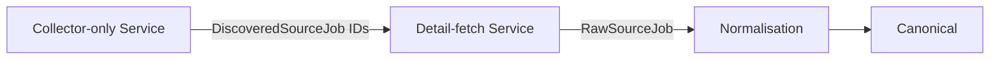

# Architecture Overview

## 1. WHAT IS HIREANDTECH?
HireAndTech is a service that gathers public job listings, cleans the data, and stores it in one place so users can search for jobs quickly.

## 2. WHY DO WE NEED IT?
Collecting jobs every time a user searches would waste time, network bandwidth, and money. A shared job store lets many users reuse the same data.

## 3. OLD ARCHITECTURE ( SIMPLE DESCRIPTION )
A user request started a chain: the system scraped the web, processed the data with AI, saved it, and finally returned the result to the user. This happened for every search.

## 4. PROBLEMS WITH THE OLD ARCHITECTURE
- **Duplicate work** – the same job was scraped many times.
- **Jobs tied to users** – each user got its own copy of a job.
- **Slow response** – scraping and AI had to finish before the user saw anything.
- **One worker does everything** – a busy worker slowed the whole system.

## 5. NEW ARCHITECTURE IDEA ( SIMPLE SENTENCE )
HireAndTech continuously collects jobs in the background and stores them in a global database. When a user searches, the system only reads from this database.

## 6. CONTINUOUS BACKGROUND COLLECTION
A scheduler runs regularly, telling workers to fetch new jobs from sites like Dice, LinkedIn, Glassdoor, and HiringCafe. The work is queued so it can happen anytime, not during a user request.

## 7. NORMALIZATION
Different sites name the same information differently (e.g., `jobTitle`, `title`). Normalization converts all source data into a common format with fields such as title, company, location, and description. After this step the rest of the system does not need to know which site the data came from.

## 8. DEDUPLICATION
The system checks whether a job already exists. It removes exact duplicates from the same source and also tries to recognise the same job appearing on multiple sites, keeping only one canonical record.

## 9. FRESHNESS
Each job records when it was posted, when it was first seen, and when it was last seen. Fresh jobs (recently posted) are given higher priority in search results.

## 10. GLOBAL JOB DATABASE
All cleaned and deduped jobs are stored in a single database table. Users only read from this table. The legacy `global_jobs` table still exists for backward compatibility but new data is written to the canonical tables.

## 11. FASTAPI ( API LAYER )
FastAPI receives HTTP requests from the frontend, validates them, and quickly hands off work to background queues. It never performs heavy scraping or AI inside the request.

## 12. REDIS QUEUES
Redis holds tasks that workers need to perform. FastAPI puts a task in a queue, and a worker later picks it up. This smooths traffic spikes.

## 13. SEPARATE WORKER POOLS
Different kinds of work have their own workers:
- **Search workers** handle user queries.
- **Scrape workers** collect jobs from websites.
- **AI workers** run expensive AI models.
If one pool becomes slow, the others keep working.

## 14. USER SEARCH FLOW
1. User sends a search request.
2. FastAPI puts the request in the search queue.
3. A search worker reads jobs from the global database.
4. The worker filters, matches, ranks, and returns the result.
No live scraping happens during this flow.

## 15. FILTERING BEFORE AI
Cheap filters (location, skills, experience) run first to shrink the number of jobs. Only the remaining small set is sent to AI, saving cost and time.

## 16. RESUME ↔ JOB MATCHING
A resume lists a user’s skills and experience. A job lists required skills, location, etc. The system compares them to produce a relevance score.

## 17. RANKING
Jobs are ordered by their relevance score, freshness, and user preferences. The highest‑scoring jobs appear at the top of the list.

## 18. WHERE AI IS USED
AI is applied after filtering and ranking, only to a small subset of promising jobs. It can explain why a job matches or suggest skill gaps.

## 19. JOBS VS JOB MATCHES
- **Jobs** are global records shared by everyone.
- **Job matches** are the relationship between a specific user and a specific job (e.g., User A matches Job 123 with 94% relevance).

## 20. APPLICATION FLOW
The user clicks a recommended job, is taken to the original job posting, and can apply. The system can track the application status (applied, interviewed, offered, etc.).

## 21. SCALING
Each component can be replicated independently. If searching becomes a bottleneck, more search workers can be added. If scraping is heavy, more scrape workers can be added.

## 22. LOAD BALANCER
A load balancer distributes incoming API requests across multiple FastAPI servers, ensuring no single server becomes overloaded.

## 23. SOURCE FAILURE HANDLING
If a source like LinkedIn is down, the system continues serving jobs from the other sources. Missing sources simply do not contribute new jobs until they recover.

## 24. AI FAILURE HANDLING
If the AI service is unavailable, the system still returns basic search results and continues collecting jobs. AI‑enhanced features are delayed but the core functionality works.

## 25. TIMEOUTS, RETRIES, CIRCUIT BREAKERS
- **Timeout** stops waiting for a slow source.
- **Retry** attempts the operation a few times.
- **Circuit breaker** temporarily stops calling a repeatedly failing source.

## 26. CDN
A Content Delivery Network serves static frontend files (HTML, CSS, JavaScript) from locations close to the user, making the UI load faster.

## 27. WAF
A Web Application Firewall inspects incoming traffic and blocks malicious requests (e.g., SQL injection, XSS) before they reach the API.

## 28. RATE LIMITING
Rate limiting caps how many requests a user or IP can make in a short period, protecting the system from abuse.

## 29. COMBINED SECURITY LAYER
Internet → CDN → WAF → Rate Limiter → Load Balancer → API servers → Redis queues → Workers → Database.
Each layer adds security, performance, or scalability.

## 30. COMPLETE FLOW (COLLECTION + USER SIDE)
**Job collection side**: Sources → Scheduler → Scrape queue → Scrape workers → Raw jobs → Normalization → Deduplication → Freshness → Global job database.
**User side**: User → Frontend → FastAPI → Search queue → Search worker → Global job database → Filter → Match → Rank → AI (optional) → Results.

## 31. OLD VS NEW COMPARISON
- **Old**: User request → live scrape → AI → store → response.
- **New**: Background collection builds a shared job store; user request reads from the store, filters, matches, and optionally uses AI.
The new design is faster, cheaper, and more reliable.

## 32. ONE‑SENTENCE SUMMARY
HireAndTech continuously builds a shared job database and lets users search that database, removing the need to scrape the internet for every search.

---
*Document generated and verified against the repository on 2026‑09‑25.*

## Purpose
The **HireAndTech** backend is a service that discovers, normalises, and stores job listings from multiple public sources (Dice, LinkedIn, Glassdoor, HiringCafe).  It exposes a clean, version‑stable API for downstream consumers (web UI, mobile apps, data pipelines) while internally handling the complexity of scraping, de‑duplication and canonicalisation.

## Design Principles
- **Separation of concerns** – collection, normalisation, persistence, and API layers are independent modules.
- **Async first** – FastAPI + SQLAlchemy async + ARQ workers provide high concurrency with low latency.
- **Source‑agnostic canonical model** – a single source‑independent representation (`jobs`, `companies`, `job_sources`) is the truth of record.
- **Backward compatibility** – the legacy `global_jobs` table remains for any existing read‑paths, but all new writes target the canonical tables.
- **Observability & resilience** – each step logs structured events; failures in one source do not affect others.

## Current Architecture
```mermaid
flowchart TD
    subgraph API[FastAPI (ASGI)]
        A1[/HTTP Request/] --> A2[Jobs Router]
    end
    subgraph Collector[Job Collection Engine]
        C1[CollectionCoordinator] --> C2[Collector Registry]
        C2 -->|resolve| D1[Source Collectors]
        D1 -->|DiscoveredSourceJob| N1[Normalization]
        N1 -->|NormalizedJob| I1[CanonicalJobIngestionService]
    end
    subgraph Persistence[Database Layer]
        I1 -->|writes| DB1[(jobs, companies, job_sources)]
        I1 -->|dual‑write| DB2[(global_jobs – legacy)]
    end
    subgraph Queue[Background Workers]
        Q1[ARQ + Redis] --> Q2[Workers (collect_jobs.py, periodic refresh)]
    end
    subgraph Auth[Security]
        S1[Supabase JWT] --> A1
    end
    A2 -->|trigger| Q1
    Q2 -->|invoke| C1
```
### Verified Data Model
- **Canonical tables**: `jobs`, `companies`, `job_sources` (SQLAlchemy models `CanonicalJob`, `Company`, `JobSourceObservation`).
- **Legacy table**: `global_jobs` (model `GlobalJob`) is kept only for backward‑compatible read‑paths; new ingestion writes to the canonical tables.

## Component Responsibilities
- **API Layer** – FastAPI routes, request validation, OpenAPI spec.
- **CollectionCoordinator** – orchestrates a collection run, iterates over configured sources, handles deduplication & freshness.
- **Collector Registry** – factory that resolves a `JobSource` enum to its concrete collector implementation under `app/jobs/sources/`.
- **Source Collectors** – perform discovery (`discover`) and detail fetching (`fetch_details`) returning `RawSourceJob` objects.
- **Normalization** – `app/jobs/normalization` converts `RawSourceJob` → `NormalizedJob` (common field names, content hash).
- **CanonicalJobIngestionService** – idempotent upsert into `jobs`, `companies`, `job_sources`; also writes to `global_jobs` for legacy compatibility.
- **Repository Layer** – `CanonicalJobRepository` implements locking, company resolution, and source identity management.
- **Queue / Workers** – ARQ + Redis runs the `collect_jobs.py` CLI as a background task and periodic refresh jobs.
- **Auth / Security** – Supabase JWT validation in `app/security/` protects API endpoints.

## Data Flow (High‑level)
1. **API request** → FastAPI route (`/api/v1/jobs`).
2. **Collection trigger** – `scripts/collect_jobs.py` invokes `CollectionCoordinator` (executed in an ARQ worker).
3. Coordinator resolves the appropriate **collector** and calls `discover` → list of candidate source IDs.
4. Freshness / deduplication filter determines which candidates need a detailed scrape.
5. Collector fetches **raw source jobs**; each is passed to **normalizer** → `NormalizedJob`.
6. `CanonicalJobIngestionService.ingest` writes the canonical representation to `jobs`, `companies`, `job_sources` and also upserts a row in `global_jobs`.
7. Post‑processing (e.g., enrichment, indexing) is queued to ARQ workers.

## Target / Future Architecture
The planned evolution isolates the expensive detail‑fetch step into its own horizontally‑scalable service:

- **Collector‑only service** – stateless HTTP/gRPC that only performs discovery.
- **Detail‑fetch service** – receives a batch of IDs, performs the heavy page renders (Playwright) and returns raw payloads.
- The existing `CollectionCoordinator` becomes a thin orchestrator that calls these two services.
- All downstream components (normalisation, ingestion, API) remain unchanged.

## Failure Isolation & Scalability
- Each source runs in its own coroutine; a failure in one collector does not abort the whole run.
- ARQ workers can be autoscaled; the detail‑fetch service can be horizontally scaled behind a load balancer.
- Database writes are performed inside a single transaction per source observation to guarantee atomicity.

## Security Boundary
- inbound API traffic is protected by Supabase JWT verification.
- Redis credentials are stored as secrets (`HIREANDTECH_REDIS_URL`).
- No source credentials are persisted; collectors use environment‑provided tokens where required.

## Architectural Rules (non‑exhaustive)
- **Canonical source of truth** – all client‑facing reads should query `jobs`/`companies`/`job_sources`.
- **Legacy reads** – may fall back to `global_jobs` until migration is complete.
- **Idempotent ingestion** – ingestion must be safe to retry; deduplication is based on `(source, source_job_id)`.
- **Observability** – every major step logs a structured event with job IDs, source, and outcome.
- **No blocking I/O** – all network and DB interactions are async.

---
*Document generated and verified against the current repository state on 2026‑09‑25.*
